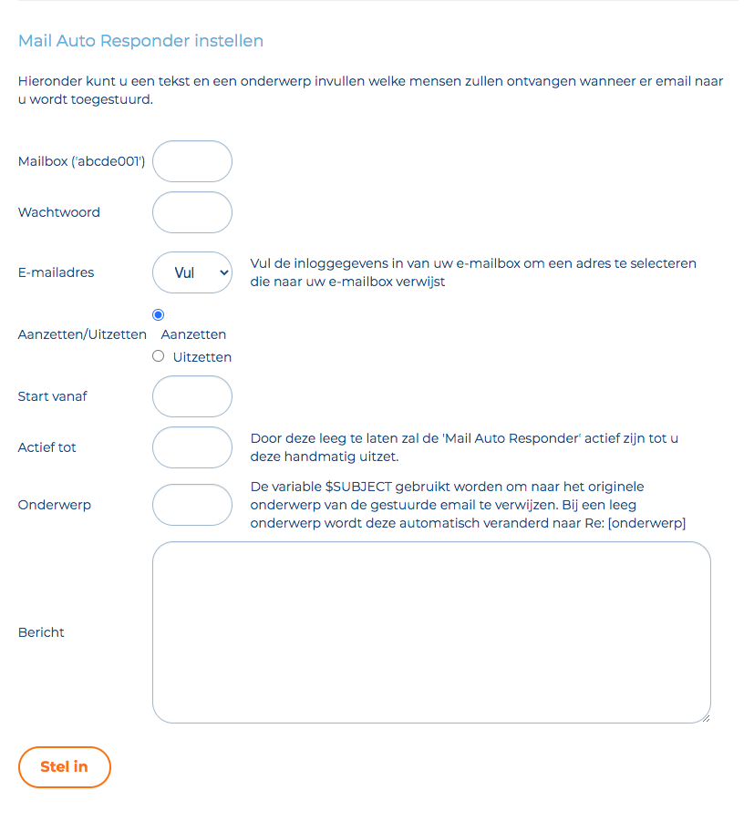

---
myst:
  html_meta:
    description: Read how you can create an autoresponder for your email address in
      this article
---

<!-- source: https://support.hypernode.com/en/best-practices/email/how-to-enable-an-autoresponder-out-of-office-for-your-email-address/ -->

# How to Enable an Autoresponder/ Out of Office for Your Email Address

**Please note that this only applies to Service Panel users who log in via service.byte.nl. We don't offer email hosting for our international customers at the moment.**

You can use an autoresponder when you are not available for a period of time, for example a vacation. An autoresponder will send an automatic message to whoever sends you an email with an automatic message you can compose yourself.

In this article, we explain how to enable an autoresponder for email addresses that you have created via the Service Panel.

## Autoresponder at Hypernode

Hypernode has an autoresponder option for all your email addresses. As soon as email arrives for you on the Hypernode mailserver and you have enabled an autoresponder for that email address, the text you set will be sent to the sender address.

It may occur that an autoresponder sends a message to an address where another autoresponder also automatically replies to the email. To prevent a conflict between the two autoresponders, Hypernode's autoresponder sends an email to the sender once every two days at most.

## How to Enable an Autoresponder at Hypernode

You have to different options to create an autoresponder at Hypernode:

- by using the autoresponder form (no Service Panel password needed)
- in the Hypernode Service Panel

## Use the Autoresponder Form

Got to the [autoresponder](https://service.byte.nl/mail/outofoffice.cgi) page. You can enable an autoresponder by using this form. To do so fill in the following information:

- For **Mailbox**fill in the name of your mailbox (e.g. abcde1234)
- For **Password**fill in the password for this mailbox
- Select the email address
- Choose for either **Aanzetten**(to activate the autoresponder) or **Uitzetten**(to turn off the autoresponder)
- Fill in the date on which the autoresponder should be activated in the entry field behind **Start vanaf**
- Fill in the date on which the autoresponder should be turned off in the entry field behind **Actief tot**
- You can create the subject line in the entry field behind **Onderwerp**
- In the entry field for **Bericht**you can set up the message for the autoresponder
- Then click **Stel in**to save the settings

## Create the Autoresponder in the Service Panel

- Log in to the [Service Panel](https://service.byte.nl/)
- Select the domain for which you want to enable the autoresponder
- Go to 'Instellingen' and then 'Email'
- Click on the icon (arrow) for the autoresponder behind the email address for which you want to enable this
- Click on the agenda next to **Startdatum**
- Select a begin and an end date
- You can create the subject line in the entry field behind **Onderwerp**
- In the entry field for **Bericht**you can set up the message for the autoresponder
- Click on **Activeren**to save the settings

## Create an Email Forward

In stead of enabling an autoresponder, you can also create an email forward to another address. You can find how to do so [here](https://support.hypernode.com/en/hypernode/email/email-faq#Can-I-Forward-Email-to-an-Existing-Address).
