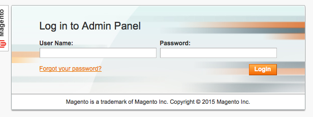
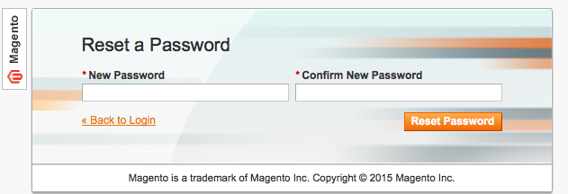

---
myst:
  html_meta:
    description: If you are unable to login to your Magento shop, you have several
      methods to retrieve a new password to log back in. Check out here how to reset
      your password.
redirect_from:
  - /en/support/solutions/articles/48000970831-how-to-reset-your-magento-1-x-admin-password/
---

<!-- source: https://support.hypernode.com/en/support/solutions/articles/48000970831-how-to-reset-your-magento-1-x-admin-password/ -->

# How to Reset Your Magento 1.x Admin Password

If you are unable to log in to your Magento shop, you have several methods to retrieve a new password to log back in.

These methods are:

- Use the ‘Reset password’ functionality
- Let someone else reset the password for you
- Change the password using `magerun`
- Insert a new password in the database

## Use the Reset Password Functionality

Visit your Magento admin backend in a browser, and click the link **Forgot your password**.



Next insert your email address and press the **Retrieve Password** button.

An email will be sent to your email address, containing a password reset link.

An email will be sent to your email address, containing a password reset link. Click the **RESET PASSWORD** link, or paste the link in your browser.

You then will be asked to insert a new password. Insert the password twice and click the **Reset Password** button to save your changes.



## Reset Passwords Via the Magento Admin Backend

Using the Magento backend, you can only reset a password if you happen to know your current password, or with a little help from someone else with a valid set of credentials.

If you don’t know your current Magento admin credentials, you can either use the **[Reset Password](#use-the-reset-password-functionality)** functionality as explained earlier, or change your password with the tools mentioned below.

### Reset Your Own Password Via the Magento Backend

To reset a password through the Magento backend, access the backend in your browser, and login using the credentials of you user account. Next, select `System` -> `My Account`:


From the **My Account** management page, insert your **current password** and second, insert your new password twice. After that, click the **Save Account** Button in the top-right corner of the page.

### Reset Someone Else's Password Using the Magento Admin Backend

To reset another users credentials, insert the name of the particular user, first, select `System` -> `Permissions` -> `Users`.


From there, select the user you want to perform a password reset for. You now will be taken to the **User Information** page. Next, insert your own password in the **Current Admin Password** field, insert a new password for the user and select **Save User**

Next, insert your own password in the **Current Admin Password** field, insert a new password for the user and select **Save User**

## Change the Password Using Magerun

The `magerun` Magento management commandline utility provides a plugin to create, edit and delete users. With this plugin you can easily change the password for an existing user by running the following commands:

```bash
cd ~/public
magerun admin:user:change-password [username]
```

This will show a password prompt. Insert the password and test if you can login on the webinterface. The plugin does not ask for a confirmation, so it might be smart to test the password right after changing it.

## Change the Password Directly in the Database

Additionally you can change the passwords for admin users directly in the database. This is for experts only and not the easier way. If you are not familiar with using MySQL, use the `magerun` plugin.

### Set a New Password Using phpMyAdmin

First, log in to phpMyAdmin:

- Go to phpMyAdmin on the Hypernode by visiting <http://appname.hypernode.io/phpmyadmin>.
- Login with the username and password in `~/.my.cnf`
- Select the prod database on the left side panel.
- In the top bar, select the `SQL` tab.

Next, follow the instructions below:

- Paste the following query:
  ```mysql
  UPDATE admin_user SET password = CONCAT(MD5('$SALT$PASSWORD'), ':$SALT') WHERE username = '$USERNAME';
  ```
- Replace `$PASSWORD` with the new admin password and replace `$USERNAME` with the username you want to change the password for.
- Replace `$SALT` with a random string of characters. Use the same random string in both parts of the SQL query. The string should be just 2 characters.
- Click `Go` to execute the query, and login with the given username using the new password.

If your Magento 1 shop uses table prefixes add the prefix to your table name. IE: If your table prefix is mage\_, use the following query instead:

```mysql
UPDATE mage_admin_user SET password = CONCAT(MD5('$SALT$PASSWORD'), ':$SALT') WHERE username = '$USERNAME';
```

### Set a New Password Via the MySQL CLI

*Changing a password using the mysql client rather then PHPmyAdmin uses the same queries as mentioned earlier. Only use this option if you know what you are doing, as you can easily break stuff in your shop.*

First, let’s set some variables. Change the values to your preferred values:

```bash
export USERNAME="exampleuser"
export PASSWORD="Randompassword123"
export DATABASE="magento_live"
export TABLE_PREFIX="mage_"
export SALT="$( < /dev/urandom tr -dc _A-Z-a-z-0-9 | head -c${1:-32};echo; )" ## Or pick your own random password
```
