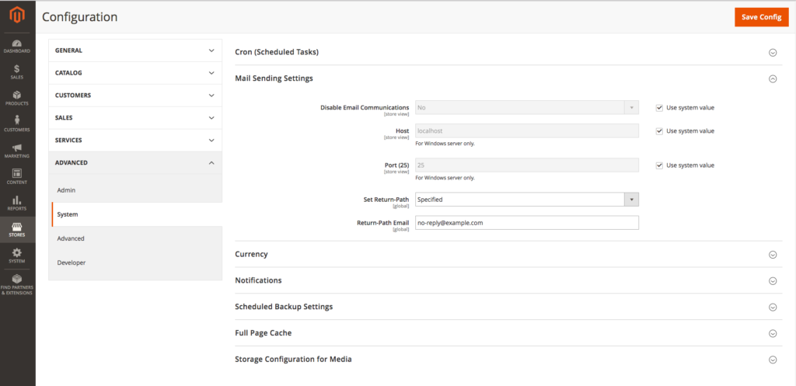

---
myst:
  html_meta:
    description: To avoid outgoing mail being detected as spam, you can change the
      mail return-path for your outgoing email to a valid address. Here's how to do
      so in Magento 2.
redirect_from:
  - /en/ecommerce/magento-2/how-to-set-the-return-path-for-a-magento-2-shop/
  - /en/ecommerce/magento-2/workaround-return-path-email-bug-in-magento-2/
  - /knowledgebase/set-return-path-email-sent-from-magento-shop/
---

<!-- source: https://support.hypernode.com/en/ecommerce/magento-2/how-to-set-the-return-path-for-a-magento-2-shop/ -->

# How to Set the Return-Path For a Magento 2 Shop

When you send emails from your Magento shop with no `return-path` set, the `return-path` will default to noreply@hypernode.io. This email address may be recognised as a spam address by spam filters, as it is a very generic email used on all Hypernodes with the same email configuration.

To avoid outgoing email being detected as spam, you should change the email `return-path` for your outgoing email to a valid email address (e.g. sales@example.tld) which can be managed with your own SPF settings.

If the recipient is using SAV (Sender Address Verification), and the email address is not reachable, or the SPF record does not match the email source, a spamfilter could see this as a spam message.

## Change Your Return-Path

Every email has two senders. The first sender is the From line that is seen in the mailclient as the recipient. The other is the Return-Path. The latter address is used for errors (bounces) to control the delivery of the mail to the sender.

### Set the Return-Path for Your Magento 2 Shop

To set the return-path for your Magento 2 shop log n on the admin panel and follow the instructions:

- Login to your Magento admin panel.
- Navigate to `Stores` > `Configuration` in the side navigation panel.


- From the `Advanced` section, select `System` and in the dropdown on the right select **Mail Sending Settings**:



- Change **Set Return-Path** to "specified".
- In the **Return-Path Email** field, set a valid email address:


- Click **Save Config** to save the changes.

## Workaround Return-Path Email Bug in Magento 2

In some versions of Magento 2 setting the `return-path` [does not work](https://github.com/magento/magento2/issues/6146). The setting is ignored and the system’s return path is used anyway. This is a notorious bug in Magento 2 which unfortunately has not been fixed yet although the Magento Community Engineering team [is aware of this issue](https://github.com/magento/magento2/issues/6954).

### Our Fix for Hypernode Customers

In order to provide a solution for Hypernode customers who experience issues with setting a return-path we have made it possible to override the system return path in a way that it will be kept across migrations between Hypernode plans. The setting is configurable by our customers themselves, so that they can update the default noreply@hypernode.io return-path to something else.

You can use the following command on your Hypernode to set the `return-path` to your own email address via our API.

```bash
hypernode-systemctl settings override_sendmail_return_path --value mail@domain.ext
```

You can verify whether you entered the right return-path with the following command:

```bash
php -i | grep sendmail_path
```

Full details on this workaround can be found at [our Hypernode Changelog](https://changelog.hypernode.com/changelog/release-5073-configurable-return-path-outgoing-mail-workaround-magento-2-sendmail-bug/).
