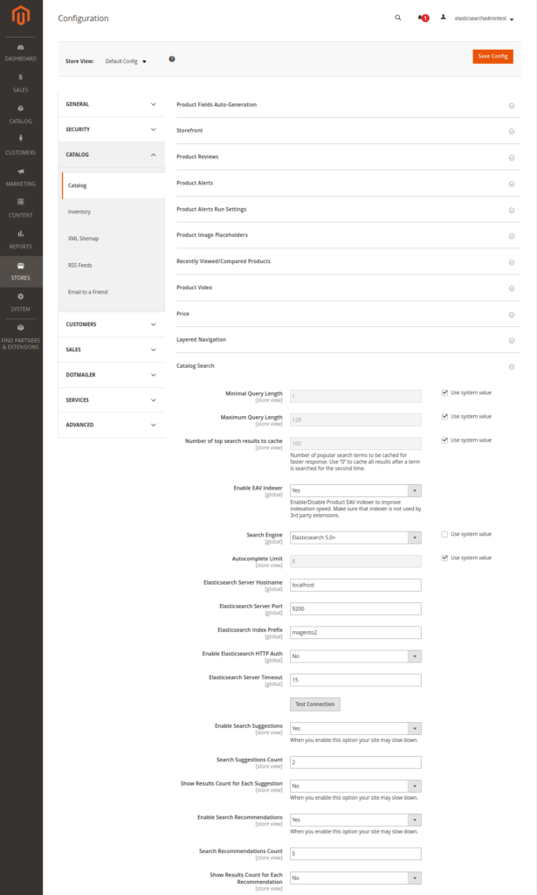

---
myst:
  html_meta:
    description: Elasticsearch can be used to search in your Magento shop without
      any external service or configuration. This article explains how to enable and
      configure it.
---

<!-- source: https://support.hypernode.com/en/hypernode/tools/how-to-use-elasticsearch-on-hypernode/ -->

# How to Use Elasticsearch on Hypernode

While previously it was already possible to use Elasticsearch with your Hypernode by [connecting to an external search provider](https://support.hypernode.com/knowledgebase/how-to-improve-your-magento-search/#ElasticSearch), we have now made it possible to use Elasticsearch for search in your Magento shop out of the box on Hypernode without requiring any external service or configuration. In this article we'll explain a bit more about Elasticsearch and how to enable and configure it.

## What is Elasticsearch?

Elasticsearch is a powerful search engine built around Apache Lucene which was later merged with Solr. A long time ago we added Solr as an opt-in feature for Hypernode, but back in 2017 we again deprecated that feature on Hypernode in favor of Sphinx as Solr integrations were rarely used, and if they were an external solution would often be more fitting. Now in 2019 the landscape has shifted and Elasticsearch is the big winner in the world of search.

The implementation of Elasticsearch on Hypernode is built for this primary use-case of search in a Magento or Shopware shop. Because of this there are some constraints that you need to be aware of. If you intend to use Elasticsearch in your Magento/Shopware shop as the search engine like described in the Magento/Shopware docs or in one of the well known third party modules like Smile ElasticSuite then Elasticsearch on Hypernode will give you a plug-and-play installation ready to go. But if you intend to do more than that like building a full ELK Stack around your shop with custom integrations, **then using an external search provider might still be a better fit**, both for flexibility and for guarantees regarding persistent data.

*If you do want to treat Elasticsearch as a primary database, you should not use the Elasticsearch instance on the Hypernode itself but arrange something externally instead. While we will keep the data between plan upgrades and downgrades, you should regard the built-in Elasticsearch on Hypernode as a cache (akin to how we treat Redis on Hypernode), and not as a consistent database. It is possible that due to future upgrade paths or as a result of a backup restore scenario the data stored in the Elasticsearch will be lost.*

In our release note you'll find a [more detailed description of Elasticsearch.](https://support.hypernode.com/changelog/release-6270-elasticsearch-on-hypernode/)

## How to Enable Elasticsearch on Hypernode

**Please note that when you change versions all Elasticsearch data will be deleted.**

Elasticsearch can be enabled on all Hypernodes. To enable Elasticsearch, you can [talk to the API](https://community.hypernode.io/#/Documentation/hypernode-api/settings/README) or use the [hypernode-systemctl command-line tool](https://support.hypernode.com/knowledgebase/hypernode-systemctl-cli-tool/). First configure the Elasticsearch version you wish to use. You can see the available versions of Elasticsearch which you can use on your Hypernode when running hypernode-systemctl settings. This will show the following:

```bash
$ hypernode-systemctl settings |& grep elasticsearch_version
elasticsearch_version ['6.x', '7.x']
```

To switch to `6.6` , you can change this value by issuing the following command:

```bash
$ hypernode-systemctl settings elasticsearch_version 6.x
Operation was successful and is being processed. Please allow a few minutes for the settings to be applied. Run 'livelog' to see the progress.

```

We also support 7.x. You can start using Elasticsearch 7.6 on your Hypernode by running the command:

```bash
$ hypernode-systemctl settings elasticsearch_version 7.x
```

Our automation will pick this up and start an update job to apply the new version of Elasticsearch to your Hypernode.

At this point, Elasticsearch is not yet enabled. You can verify this by checking if the process is running and by looking at the configured value according to the API:

```bash
$ ps aux | grep elastic | grep -v grep
$ # no output
$ hypernode-systemctl settings elasticsearch_enabled
elasticsearch_enabled is set to value False

```

When you choose to enable Elasticsearch on a production node, keep in mind that Elasticsearch will use a lot of resources. We allocate up to 10% of the system memory as the [JVM heap](https://www.elastic.co/guide/en/elasticsearch/reference/current/heap-size.html), with a maximum of 10GB or RAM. Note that the service can have a big impact on the CPU and [IO utilization](https://support.hypernode.com/knowledgebase/magento-disk-performance-optimization/) of your Hypernode. If you notice adverse effects, you can disable the service again or consider upgrading (especially if you already have other opt-in features like [RabbitMQ enabled as well](https://support.hypernode.com/changelog/platform/release-6052-rabbitmq-on-hypernode/)).

To enable Elasticsearch you can run the following:

```bash
$ hypernode-systemctl settings elasticsearch_enabled True
Operation was successful and is being processed. Please allow a few minutes for the settings to be applied. Run 'livelog' to see the progress.

```

If you are on a plan that does not support it, you will see the following message:

```bash
$ hypernode-systemctl settings elasticsearch_enabled True
Looks like something went wrong: b'{"elasticsearch_enabled":["Elasticsearch cannot be enabled for this app. Please upgrade to a plan that supports Elasticsearch if you want to make use of this feature."]}'

```

Once you have enabled Elasticsearch you use `hypernode-log` or `livelog` to keep track of the `update_node` job that will deploy the software. Once that has completed you should see the new process on the node:

```bash
$ ps aux | grep elasticsearch | grep -v grep
elastic+ 11534  0.1 19.6 2699076 403160 ?      SNsl Mar12   2:12 /usr/bin/java -Xms199m -Xmx199m -XX:+UseConcMarkSweepGC -XX:CMSInitiatingOccupancyFraction=75 -XX:+UseCMSInitiatingOccupancyOnly -XX:+DisableExplicitGC -XX:+AlwaysPreTouch -server -Xss1m -Djava.awt.headless=true -Dfile.encoding=UTF-8 -Djna.nosys=true -Djdk.io.permissionsUseCanonicalPath=true -Dio.netty.noUnsafe=true -Dio.netty.noKeySetOptimization=true -Dio.netty.recycler.maxCapacityPerThread=0 -Dlog4j.shutdownHookEnabled=false -Dlog4j2.disable.jmx=true -Dlog4j.skipJansi=true -XX:+HeapDumpOnOutOfMemoryError -Des.path.home=/usr/share/elasticsearch -cp /usr/share/elasticsearch/lib/elasticsearch-5.2.2.jar:/usr/share/elasticsearch/lib/* org.elasticsearch.bootstrap.Elasticsearch -p /var/run/elasticsearch/elasticsearch.pid --quiet -Edefault.path.logs=/var/log/elasticsearch -Edefault.path.data=/var/lib/elasticsearch -Edefault.path.conf=/etc/elasticsearch

```

Note that we only bind the Elasticsearch ports on the local host:

```bash
$ netstat -tulpn | grep '9200\|9300'
(Not all processes could be identified, non-owned process info
 will not be shown, you would have to be root to see it all.)
tcp        0      0 127.0.0.1:9200          0.0.0.0:*               LISTEN      -
tcp        0      0 127.0.0.1:9300          0.0.0.0:*               LISTEN      -

```

If you wish to access them directly from your computer (instead of only having the shop talk to the instance), you can perform a local forward to tunnel the port locally:

```bash
ssh -L 9200:localhost:9200 app@yourhypernodename.hypernode.io

```

If you ever need to switch between `6.x` to `7.x` or back after you have already been using it, note that **when you change versions all Elasticsearch data will be deleted**. When you are using the default Magento implementation that should be OK since you can just re-index the data.

## How to Configure Magento to Use Elasticsearch

Since Magento 2.3, Elasticsearch can be used as [a default search provider](https://devdocs.magento.com/guides/v2.3/config-guide/elasticsearch/es-overview.html). Here we will provide a short walk-through of how to configure using this default integration on your Hypernode. Once you've made sure you have enabled Elasticsearch and set the version to for example 6.2 , you can configure Magento to use it as the search backend. This example will use a fresh [Magento 2.3 shop with sample data](https://github.com/magento/magento2-sample-data/tree/2.3).

First, log in to the Magento backend with an admin account. In my case with the sample shop I first had to create that:

```bash
$ php bin/magento admin:user:create --admin-user='elasticsearchadmintest' --admin-password='thepassword' --admin-email='example@example.com' --admin-firstname='Firstname' --admin-lastname='Lastname'

```

Then, just follow the first step from [this guide](https://devdocs.magento.com/guides/v2.3/config-guide/elasticsearch/configure-magento.html). Navigate your way through `Stores > Settings > Configuration > Catalog > Catalog > Catalog Search`. On that page you can configure the settings as such:



You can press `Test Connection` to test the connection. If all is well you should see `Successful! Test again?`. Once that works remember to press `Save Config`. The next step is to re-index all indexers. In the command-line run the following:

```bash
$ cd /data/web/magento2
~/magento2$ php bin/magento indexer:reindex
Design Config Grid index has been rebuilt successfully in 00:00:00
Customer Grid index has been rebuilt successfully in 00:00:00
Category Products index has been rebuilt successfully in 00:00:00
Product Categories index has been rebuilt successfully in 00:00:00
Catalog Rule Product index has been rebuilt successfully in 00:00:00
Product EAV index has been rebuilt successfully in 00:00:01
Inventory index has been rebuilt successfully in 00:00:00
Catalog Product Rule index has been rebuilt successfully in 00:00:00
Stock index has been rebuilt successfully in 00:00:00
Product Price index has been rebuilt successfully in 00:00:00
Catalog Search index has been rebuilt successfully in 00:00:01

```

If you get something like:

```bash
{"error":{"root_cause":[{"type":"illegal_argument_exception","reason":"Illegal dynamic template parameter: [match_mapping]"}],"type":"illegal_argument_exception","reason":"Illegal dynamic template parameter: [match_mapping]"},"status":400}

```

It is possible that you accidentally saved `Elasticsearch` as a Search Engine instead of `ElasticSearch 6.0+` on the catalog configuration page from the screenshot above.

You should now be able to list the created index using the [\_cat API](https://www.elastic.co/guide/en/elasticsearch/reference/current/cat.html):

```bash
$ curl localhost:9200/_cat/indices
yellow open magento2_product_1_v2 0HHoI2ahT6CdX4Z5ybSKcw 5 1 187 0 469.2kb 469.2kb

```

Note that the status is yellow instead of green. This is because the index was created with an expected number of replicas. Because on Hypernode there is no Elasticsearch cluster but there is just a single instance, this is expected. If you need guarantees about the replication of your Elasticsearch data we recommend that you use another solution. For some examples check [this list](https://support.hypernode.com/knowledgebase/how-to-improve-your-magento-search/) of external Elasticsearch providers that we recommend.

You can configure your created index to expect an amount of zero replicas. That will turn the cluster status back to green. Since Elasticsearch 6`.x` it is not possible to set index level settings in the node configuration, but you can do so during runtime with this command:

```bash
$ curl -XPUT 'http://localhost:9200/_all/_settings?preserve_existing=false' -d '{
  "index.number_of_replicas" : "0"
  }'

```

This will turn the status back to green, which might be useful if you want to use this endpoint for any kind of monitoring:

```bash
$ curl localhost:9200/_cat/indices
green open magento2_product_1_v2 0HHoI2ahT6CdX4Z5ybSKcw 5 0 187 0 469.6kb 469.6kb

```

## Benefits of the Improved Search

Once Elasticsearch has been configured in the Magento installation you will be able to see its effects on the search. Here are three examples of search results in the yoga-themed Magento 2.3 sample shop. The first screenshot is the default behavior without Elasticsearch when searching for "yogaa" instead of "yoga".


This next screenshot is what you would see if you have Elasticsearch configured according to the explanation given in the previous section. This is the built-in out of the box Magento integration. It will now give you some suggestions about what you might have meant to search for.


Finally we also have a screenshot of what the search might look like with the third-party [Smile ElasticSuite](https://github.com/Smile-SA/elasticsuite/), using the new Elasticsearch 6.6. Here you can see that the search result for the "yogaa" typo will not only show you the term you might have meant, it will also immediately show you the products that you were really looking for.


## Troubleshooting

### Reindex Issues

Upon reindexation the following error might be returned if your Hypernode has reached a usage of more than 95% of its diskspace. This will result in the ElasticSearch cluster being set to *read-only*

```bash
Catalog Search indexer process unknown error:
{"error":{"root_cause":[{"type":"cluster_block_exception","reason":"blocked by: [FORBIDDEN/12/index read-only / allow delete (api)];"}],"type":"cluster_block_exception","reason":"blocked by: [FORBIDDEN/12/index read-only / allow delete (api)];"},"status":403}
```

To fix this simply run the following command via the CLI of your Hypernode:

```bash
curl -XPUT -H "Content-Type: application/json" \
     http://localhost:9200/_all/_settings \
       -d '{"index.blocks.read_only_allow_delete": false}'
```
