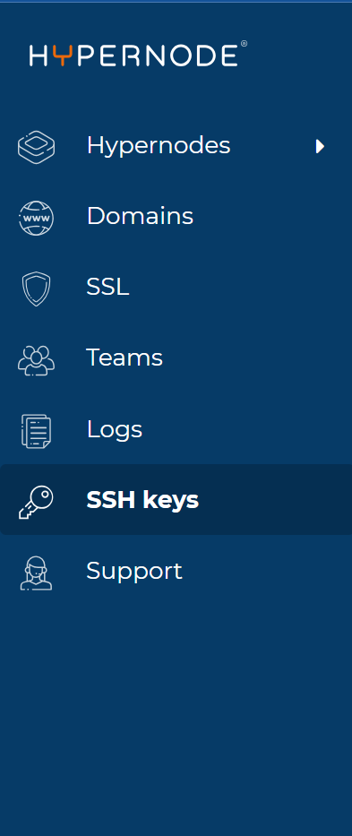
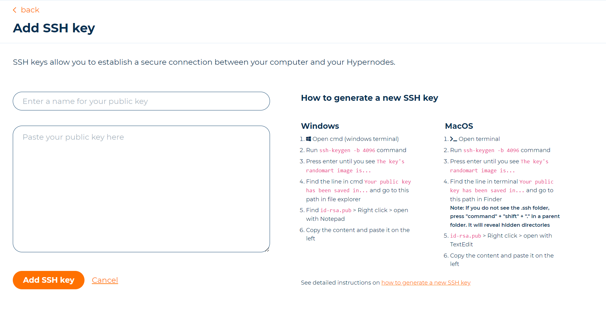
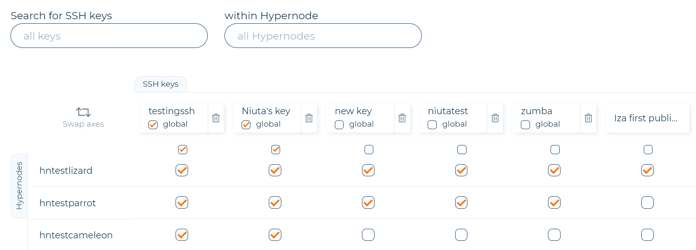

---
myst:
  html_meta:
    description: 'You can add SSH Keys to your Hypernode(s) via the Control Panel.
      Following our comprehensive guide to add an SSH key to one Hypernode. '
    title: How to add keys to the SSH key manager? Hypernode
redirect_from:
  - /en/services/control-panel/how-to-add-keys-to-the-ssh-keymanager/
---

<!-- source: https://support.hypernode.com/en/services/control-panel/how-to-add-keys-to-the-ssh-keymanager/ -->

# How to Add Keys to The SSH Key Manager

By adding your SSH key to the SSH Key Manager, you add your SSH key to all Hypernodes you have access to without having to do this for each Hypernode separately. You can also add an SSH key to one Hypernode for deployment purposes.

## Add Public Key via Your Control Panel

1. Log in to the [Control Panel](http://my.hypernode.com/).
1. From the left navigation, select **SSH keys** page.
1. You can add a new key on this page by clicking the **Add SSH key** button.
1. On the next page, paste the content of your public key into the public key field and give your SSH key a name:
   
1. Click **Add SSH key** to add the key to the Hypernode.
1. Repeat the above steps if you would like to add more keys.

A couple of things to keep in mind:

– In the SSH keys page in the Control Panel you will see an overview of all Hypernodes you have access to with associated SSH keys (both yours and other members').

– All SSH keys added by you are automatically added to Hypernodes you have access to. If you want to turn it off, uncheck **global** option.

– The following SSH public key types in the Control Panel are supported: RSA keys >= 2048 bits, ECDSA and Ed25519 keys.

– DSA and RSA keys \< 2048 bits are not permitted because they are not secure.

– You will be prompted with a clear message if there is a problem with your key.

**Limiting an SSH key to specific IP addresses**

It’s possible to restrict remote SSH logins to a single IP address when adding an SSH Key to your Hypernode. To enable this feature, simply add the ssh key options prefix from=”X.X.X.X” to your public key at the start of your public key. For example, to limit logins to IP address 1.2.3.4, you would use the following prefix on your SSH key:

from=”1.2.3.4″ ssh-ed25519 AAAA….

The IP address can be specified as a range such as from=”1.2.3.0/24″ or as a comma separated list of IP addresses such as from=”1.2.3.4,1.2.3.5″.

More information about this feature can be found in [the OpenSSH documentation](https://man.openbsd.org/sshd#from=_pattern-list_).

## Important

- The following SSH public key types in the control panel are supported: RSA keys >= 2048 bits (\*), ECDSA and Ed25519 keys.
- DSA and RSA keys \< 2048 bits * will not be permitted because they are not secure.
- You will be prompted with a clear message if there is a problem with your key.
