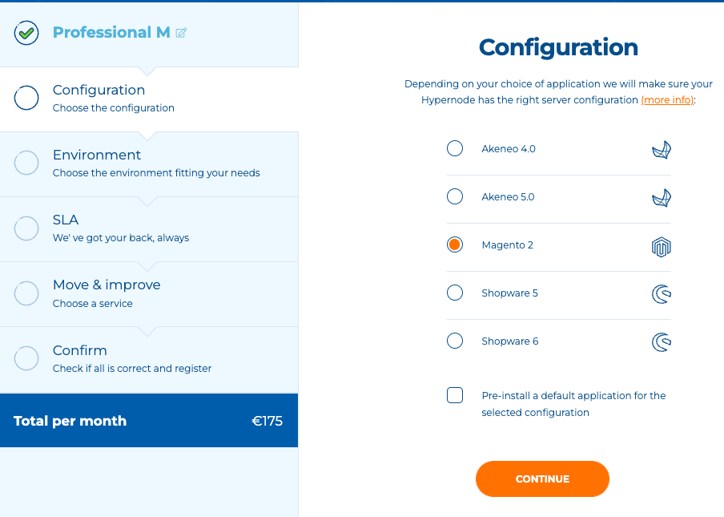
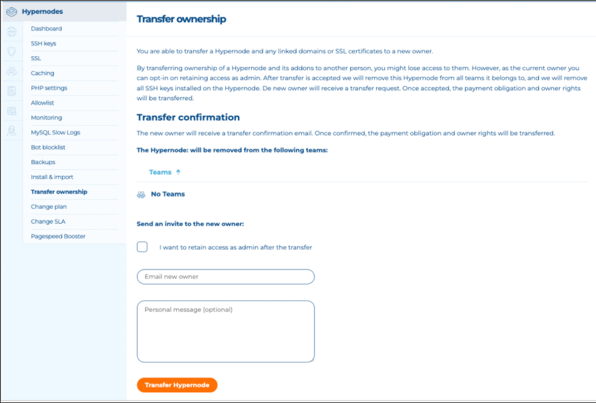

<!-- source: https://support.hypernode.com/en/support/solutions/articles/48001212568-how-to-order-a-hypernode-and-transfer-ownership-to-a-customer/ -->
# How To Order a Hypernode and Transfer Ownership To a Customer

Need a (new) hosting plan for your Magento, Shopware or Akeneo shop? You’ve come to the right place. Hypernode has been developed in close consultation with e-commerce developers, with the objective of having e-commerce web shops perform to their best advantage and to make its development several times easier. An overview of all hosting plans can be found on[our website](https://www.hypernode.com/magento-hosting-plans/).

This article will explain how to order a Hypernode and how this plan can be transferred to your customer on our Control Panel.

### Step 1: How To Order a Hypernode

You can order a Hypernode plan via our [order page](https://www.hypernode.com/magento-cloud-hosting/#plans). The Control Panel is our default panel, which means all new Hypernode plans and trials will be booted in the Control Panel.

To order a new Hypernode plan, follow these steps:

1. Log in to the Hypernode Control Panel.
2. Select 'Hypernodes' from the sidebar on the left.
3. Click on the orange 'Order Hypernode' button on the right.
4. Choose your Hypernode plan and click on the orange 'order now' button.
5. Choose the needed Hypernode plan configuration, SLA and continue:

6. Read "[Step 2: Tips For Ordering a Hypernode](https://support.hypernode.com/en/support/solutions/articles/48001212568-how-to-order-a-hypernode-and-transfer-ownership-to-customer#Step-2%3A-Tips-For-Ordering-a-Hypernode)"
7. Give your Hypernode a name and proceed to checkout.
8. Check if all information is correct and place your order.
9. The new Hypernode plan will be booted and you will receive an email when it's ready.

Please note: if you are a Service Panel user (i.e. you use the Dutch panel), please order your new plans directly via [this page in the Service Panel](https://service.byte.nl/planinfo/order-selection/). This is to prevent plans from being booted in the wrong system.

### Step 2: Tips For Ordering a Hypernode

* Choose a logical name. IE: If your site is example.com, order example.hypernode.com
* Make sure you pick a node with enough disk space for both your shop and your database.
* Don’t use environment indicators like staging test, testing, dev or development:
* Without these indicators, you can easily change this node from a live to a test node without confusion or having to migrate to a server with another name.
* Still developing a shop? Then [select a development environment first](https://support.hypernode.com/knowledgebase/development-plans-for-your-magento-shop/). When your Hypernode [is ready to go live](https://support.hypernode.com/knowledgebase/go-live-with-your-hypernode/) you can easily switch to a production node.
* Use [this article to remove a Magento installation](https://support.hypernode.com/knowledgebase/remove-magento-installation/) in case you want to reuse an existing Hypernode or accidentally ordered a Hypernode with a preinstalled Magento on it.

### Step 3: Transfer Ownership to your customer

To transfer ownership of a Hypernode you need to follow these steps:

1. Log into the Control Panel.
2. Choose Transfer ownership from the Hypernodes sidebar on the left.
3. Enter the email address of the new owner and choose whether or not to retain access as admin after the transfer.
4. The new owner receives a confirmation email and can then accept the transfer.
* **Note:**the new owner is required to have a valid payment method to accept the transfer. They have the option to do so at this step in case they do not have a valid payment method on their account.**
