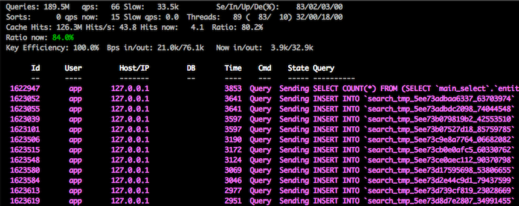

---
myst:
  html_meta:
    description: So your webshop seems to be significantly slower than it used to
      be and you have no idea what's going on. In this article you will find some
      initial checks.
redirect_from:
- /en/troubleshooting/performance/how-to-check-why-my-site-is-slow/
---

<!-- source: https://support.hypernode.com/en/troubleshooting/performance/how-to-check-why-my-site-is-slow/ -->

# How to Check Why My Site Is Slow

So your webshop seems to be significantly slower than it used to be and you have no idea what's going on.

There could be tons of reasons why the shop is suddenly a lot slower than expected. Most often this is due to a high load on the Hypernode, which in turn can be caused by a number of reasons. Below you will find some initial checks one can do in this case.

## Check if the Caches Are Enabled

```nginx
# Quickly check if caches are enabled, run this command from Magento root folder
magerun cache:list #Magento 1 version
magerun2 cache:list #Magento 2 version
```

If the caches are enabled proceed to the second check.

If not enable the caches.

```nginx
# To enable all caches, run this command from Magento root folder
magerun cache:enable #Magento 1 version
magerun2 cache:enable #Magento 2 version
```

Now wait for a bit to see if the high load is dropping with the command `htop`.

## Check if Magento 2.x Is Running in Production Mode

```nginx
# To check whether Magento 2.x runs in Application Mode 'production', run the following command from the Magento root folder
magerun2 sys:info
```

When you run this command the fourth or fifth line of the output will tell you in what **Application Mode** Magento is running. Since the **developer** and **default** modes will log more debug information, these modes are significantly slower than **production** mode. When you see that the Magento installation runs in one of the slower modes, simply change this to production.

## Run `htop` to See What Is Causing the High Load

In this example `mysqld` seems to be causing a significant load:


Run `mytop` to check the current running queries:



In the above example there seem to be quite some queries stuck. Restarting MySQL might be a fix in this case. You can do this by running the command below:

`hypernode-servicectl restart mysql`

Most of the queries in the example above, *"INSERT INTO `search_tmp`"*, are [a known bug](https://github.com/magento/magento2/issues/15545). Restarting MySQL is a quick fix, but the issue could reoccur any time.

If `php-fpm: pool www` seems to be causing the high load. Proceed with running `livefpm` to check the live feed of incoming traffic.

- Is all the traffic legit?
  - Check if there are any modules/plugins enabled or installed, this might cause extra load
  - Do you have a sale or sent out emails about the sale? An upgrade might be the best solution here
- Do you notice non-valid traffic, for example from several countries you don't sell to? [Here's](https://support.hypernode.com/en/hypernode/nginx/how-to-block-your-webshop-for-specific-countries) how to block specific countries.

If `mysqld` and `livefpm` aren't the cause, check for other processes in `htop`. It could be also be the following:

- Stuck cronjobs
- Composer processes
- Custom processes

## Check Modules and Extensions

Please note that a slower performance is not always caused by a high load on the Hypernode. There is a number of other reasons which may affect the performance.

Some modules/extensions will connect to external services. These services might not be reachable causing all processes on the Hypernode to hang/or slow down (e.g. Kiyoh reviews). It may be worth checking the `php-slow.log` to spot such issues. Check [this article from our support documentation](https://support.hypernode.com/en/troubleshooting/performance/how-to-spot-slow-extensions-using-the-php-slow-logs#Usage) for more information on this.

Some will use an extravagant amount of database queries, which slows down the whole website. Unfortunately this isn't easy to spot without analysing the what a `php-fpm process` is actually doing.

## Unable to Find a Cause?

Did you check everything mentioned above? Please feel free to contact Support so we can take another look.
